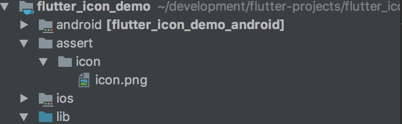
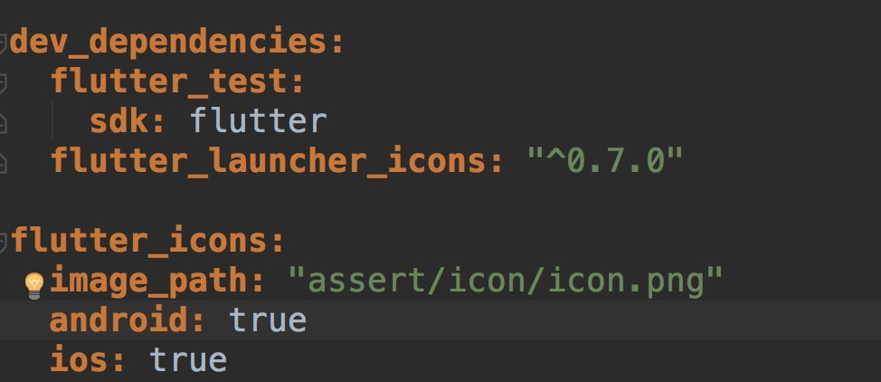
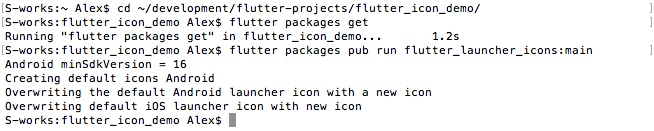
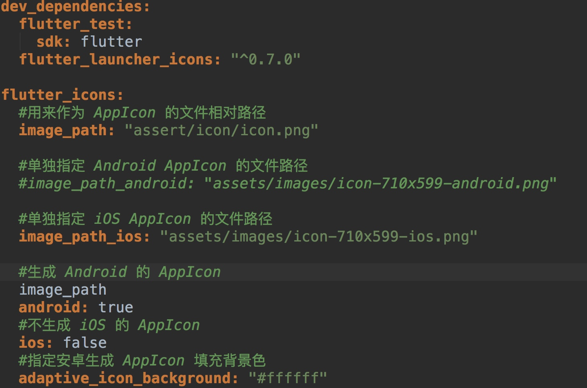

# flutter 生成 App Icon

##基本操作

1.添加图片到 flutter 工程

在 flutter 目录下新建文件夹, 命名为 assert , 为了区分 icon 与其它图片, 可以再建一层子目录名为 icon. 将用作 Icon (为了兼容 iOS 和 Android, 推荐使用 1024 * 1024) 的图片放到 icon 目录下面。如图所示:
	

2.添加插件依赖

在 pubspec.yaml 添加上需要使用的插件 flutter_launcher_icons, 因为只需要生成图片时候使用, 所以添加到 dev_dependencies 下面.
	
	
3.配置图片路径

在 pubspec.yaml 下添加图片路径的配置, 步骤 2 和步骤 3 添加好以后如图所示:

4.执行 Icon 的生成命令

**说明**:
先通过命令行 cd 到工程目录下以后, 然后执行 flutter packages get 获取到依赖工程
然后执行 flutter packages pub run flutter_launcher_icons:main 执行 app icon 的生成

5.运行检查生成的 App icon

##进阶操作
1.基本操作的步骤 2 和 3 不一定非要写在pubspec.yaml, 也可以自己创建一个配置文件, 命名为flutter_launcher_icons.yaml

2.参数说明:

| 参数名称 | iOS | Android |
| --- | --- | --- |
| true | 生成当前平台 Icon | 生成当前平台 Icon |
| false | 不生成当前平台 Icon | 不生成当前平台 Icon |
| image_path | AppIcon 文件的路径 | AppIcon 文件的路径 |
| adaptive_icon_background | iOS 无效 | 自适应填充背景 |
| adaptive_icon_foreground | iOS 无效 | 自适应填充前景 |

实例说明: 

更多可参考[官方链接](https://pub.dartlang.org/packages/flutter_launcher_icons)

