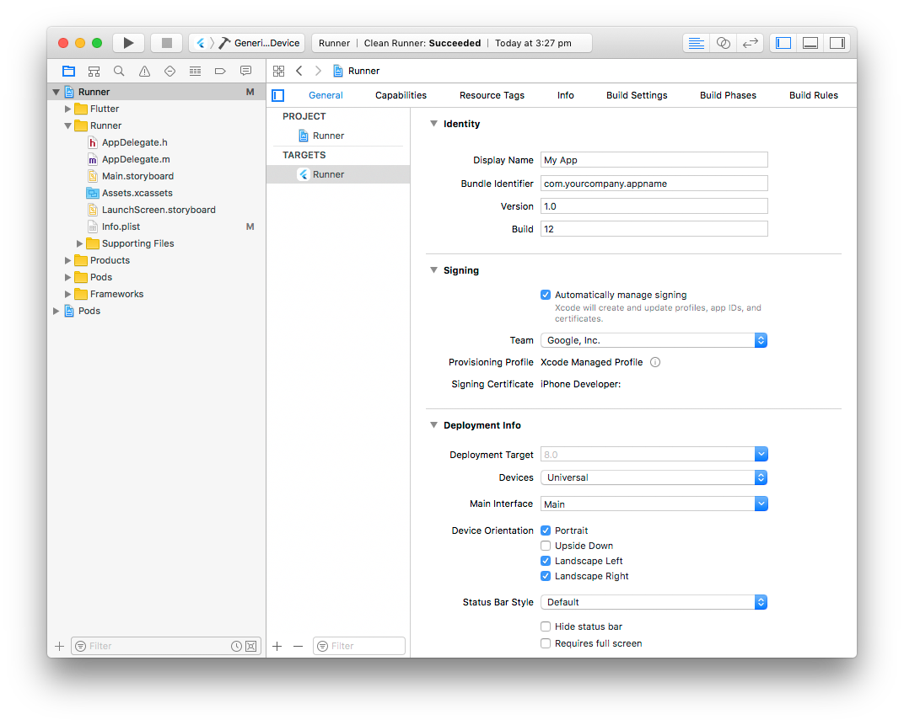

# flutter 打包

## iOS 打包
此文章默认开发者已经有账号并且注册了 BundleID, 下面仅仅说如何打包 App

1. 使用 Xcode 打开 Runner.workspace.  
2. 配置最低版本支持, BundleID, 版本信息, 应用名称, 签名证书, 描述文件 等, 如图所示

3. 在命令行中执行 flutter build ios, （flutter build 默认为--release）
4. 找到结果位于 iphoneos 下的 app

## 安装
在针对打包位企业应用时候（其它情况也可）, 上述打包结果的 app 不能直接安装, 此时需要手动处理:
1. 新建文件夹 Payload, 然后将 app 放在 Payload 中进行压缩
2. 修改压缩包后缀为 .ipa 即可得到我们可以直接安装的应用

