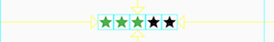

# Flutter布局
本文参照官方文档进行翻译并对部分内容进行删减, 详细参照原始[官方文档 Building Layouts](https://flutter.io/docs/development/ui/layout)

##布局机制
* Widgets 是组建 UI 的基本类单元
* Widgets 用来组建布局和 UI 元素
* 拼凑多个简单的 Widgets 来达成复杂的 Widgets

Flutter 布局的核心就是 Widgets, 几乎所有的图片, 图标, 字体等都是 Widgets。还有一些不可见的,比如 rows, colums, grids, arrange, constrain,和 align 等都是 Widgets。

比如下面的 Tab 实现：

用 Widgets 树可以表示为：

**粉红色的Container**: 
Container 是一个 Widget, 它可以约束它的子 Widget, 比如需要添加 padding, margins, borders, background color 等等的时候, 可以使用Container。

##创建简单布局
比如创建一个 Text Widget:

	Text('Hello World', style: TextStyle(fontSize: 32.0))

创建一个 Image Widget:

	Image.asset('images/myPic.jpg', fit: BoxFit.cover)
	
创建一个 Icon Widget:

	Icon(Icons.star, color: Colors.red[500])
	
Flutter App 本身也是一个 Widget, 很多 Widget 都有一个 Build() 方法, 在 Build() 方法中可创建子 Widget。如下创建了一个居中的Text: Hello World
	
	class _MyHomePageState extends State<MyHomePage> {
	  	@override
	 	Widget build(BuildContext context) {
	    return Scaffold(
	      appBar: AppBar(
	        title: Text(widget.title),
	      ),
	      body: Center(
	        child: Text('Hello World', style: TextStyle(fontSize: 32.0)),
	      ),
	    );
	  }
	}

创建一个首页为 Hello World 的简单 App
	
	import 'package:flutter/material.dart';

	void main() {
	  runApp(MyApp());
	}
	
	class MyApp extends StatelessWidget {
	  @override
	  Widget build(BuildContext context) {
	    return Container(
	      decoration: BoxDecoration(color: Colors.white),
	      child: Center(
	        child: Text('Hello World',
	            textDirection: TextDirection.ltr,
	            style: TextStyle(fontSize: 40.0, color: Colors.black87)),
	      ),
	    );
	  }
	}
	
##创建复杂布局

将简单组件进行一个一个的组合和叠加,最后达到复杂布局, 例如实现下面的复杂布局：

拆分组件的示意图如上,[代码实现参见此处](https://flutter.io/docs/development/ui/layout#nesting)

### Aligning widgets
**行**

**列**

**MainAxisAlignment**:控制当前 Widget 方向的对齐
**CrossAxisAlignment**:控制与当前 Widget 垂直方向的对齐

###Sizing widgets

使用 Expanded Widget 可以对 Widget 进行缩放, Expanded Widget 有 flex 属性, 将需要缩放的Widget 设置为其 child, 设置 flex 即可实现。

例如：需要实现居中的图片是其它图片的2倍大小

对应的实现代码如下:

	 body: Center(
	   child: Row(
	     crossAxisAlignment: CrossAxisAlignment.center,
	     children: [
	       Expanded(
	         child: Image.asset('images/pic1.jpg'),
	       ),
	       Expanded(
	         flex: 2,
	         child: Image.asset('images/pic2.jpg'),
	       ),
	       Expanded(
	         child: Image.asset('images/pic3.jpg'),
	       ),
	     ],
	   ),
	 ),
	 
###Packing widgets

如何压缩 Widget ？ 设置 mainAxisSize: MainAxisSize.min 即可。例如:

	class _MyHomePageState extends State<MyHomePage> {
	  @override
	  Widget build(BuildContext context) {
	    var packedRow = Row(
	      mainAxisSize: MainAxisSize.min,
	      children: [
	        Icon(Icons.star, color: Colors.green[500]),
	        Icon(Icons.star, color: Colors.green[500]),
	        Icon(Icons.star, color: Colors.green[500]),
	        Icon(Icons.star, color: Colors.black),
	        Icon(Icons.star, color: Colors.black),
	      ],
	    );
	
	  // ...
	}

###Nesting rows and columns
嵌套行和列,同上面的简单组合一样,先将组建拆分,然后组合。例如：

要实现红框的部分,可以将红框划分为2行, 第一行为5颗星加文字,其 Widget 树可以表示为:

第二行又可以再划分为3列,其Widget树可以表示为：

##常用组件介绍

Flutter 组件全貌: [Flutter 组件库](https://flutter.io/docs/development/ui/widgets/catalog)

**Standard widgets**: 任何应用都可以使用标准组件库中的组件
1. Container: 添加padding, margins, borders, background color, 或者其他 decorations 到 Widget 时使用
2. GridView: 可滚动的网状列表
3. ListView: 可滚动的列
4. Stack: 重叠组件到其它组件上, 类似一个棧一样

**Material Components**: 只有 Material apps 能够使用的组件
1. Card: 类似卡片一样
2. ListTile: 可简单的理解为一个带 Icon 的 Text

组件详细介绍可参考[链接](https://flutter.io/docs/development/ui/layout#common-layout-widgets)

